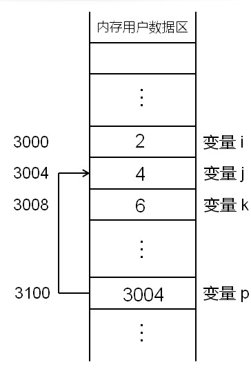

## 基本数据类型

#### 什么是数据类型

- 数据类型可以理解为固定内存大小的别名
- 数据类型是创建变量的模子

#### 数据类型的本质

- char 1字节
- shot 2字节
- int 4字节

#### 变量的本质

- 变量是一段实际连续空间的别名
- 程序中通过变量来申请并命名存储空间
- 通过变量的名字可以使用存储空间



#### 实例分析

```c
// 类型与变量的关系
#include <stdio.h>
int main()
{
  char c = 0;
  short s = 0;
  int i = 0;
  printf("%d, %d\n", sizeof(char), sizeof(c));
  printf("%d, %d\n", sizeof(short), sizeof(s));
  printf("%d, %d\n", sizeof(int), sizeof(i));
  return 0;
}
```

```c
// 自定义类型与创建变量
#include <stdio.h>
typedef int INT32;
typedef unsigned char BYTE;
typedef struct _tag_ts
{
  BYTE b1;
  BYTE b2;
  short s;
  INT32 i;
} TS;
int main()
{
  INT32 i32;
  BYTE b;
  TS ts;
  printf("%d, %d\n", sizeof(INT32), sizeof(i32));
  printf("%d, %d\n", sizeof(BYTE), sizeof(b));
  printf("%d, %d\n", sizeof(TS), sizeof(ts));
  return 0;
}
```

#### 小结

- 数据类型的本质是一个模子
- 数据类型代表需要占用的内存大小
- 变量的本质是一段内存的别名
- 变量隶属于某一种数据类型
- 变量所在的内存大小取决其所属数据类型
